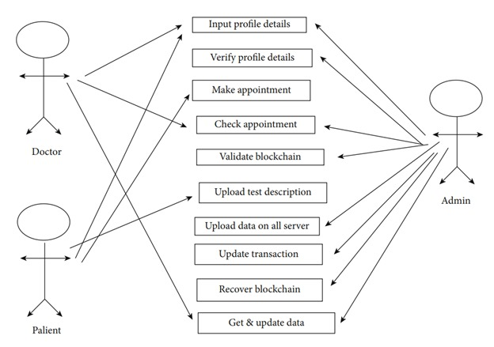

# Blockchain-Based Healthcare Records Management System

## Overview
This project implements a secure, decentralized Electronic Health Record (EHR) system using blockchain technology. By leveraging Ethereum (via Ganache), Truffle, MetaMask, and the MEAN stack, the system ensures data security, privacy, and seamless data sharing across healthcare providers.

## Key Features
- **Decentralized Storage**: Records are stored on the blockchain, ensuring data immutability and integrity.
- **Secure Data Sharing**: Patients control access to their health data through smart contracts.
- **Smart Contracts**: Automated and secure sharing of medical records using Ethereum-based contracts.
- **Interoperability**: Seamless communication between healthcare providers, improving the efficiency of medical services.

## Technology Stack
- **Blockchain**: Ethereum, Ganache, Truffle, MetaMask
- **Frontend**: AngularJS
- **Backend**: Node.js, Express.js
- **Database**: MongoDB

## Methodology
**Use Case**

